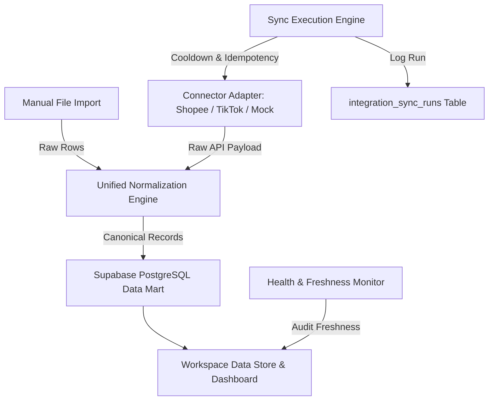

# Phase 2.0 — Marketplace Data Integration & Automation Foundation

## Executive Summary

Phase 2.0 establishes the foundation for automated data ingestion and marketplace connectors in AffiliateOS. It transitions the application from manual report uploads to a structured, repeatable connector architecture capable of performing scheduled and on-demand background synchronizations.

### Key Principles & Governance
* **Permanent Product Constraint**: As confirmed in Phase 2.1, AffiliateOS will **NOT** use live Shopee API or TikTok Shop API. Live API integrations, credential forms, OAuth onboarding, polling, web scraping, and browser automation are permanently out of product scope. Standard integration model is **File-Based Data Automation** (`FILE_IMPORT`).
* **Human Business Confirmations**: `DEFERRED BY USER`. All 8 open questions from Phase 1.7B remain deferred. No production business metric formulas or calculations were altered.
* **No Unofficial Workarounds**: Explicitly enforces zero web scraping, zero cookie capture, and zero undocumented private API workarounds.
* **Unified Normalization**: Both manual CSV/XLSX file uploads and automated batch files feed through the exact same canonical normalization pipeline (`lib/integrations/normalization.ts`).

---

## Architecture Overview



### Core Architecture Components

1. **Connector Interface (`lib/integrations/types.ts`)**:
   Defines `ConnectorAdapter`, `IntegrationConnection`, `IntegrationSyncRun`, `Capability`, `SyncRunStatus`, `ErrorCategory`, and `TriggerType`.

2. **Connector Registry (`lib/integrations/registry.ts`)**:
   Registers available providers (`shopee`, `tiktok`, `mock-test`). Evaluates connector status dynamically based on configured workspace credentials or default fallback state (`BLOCKED — CREDENTIALS / PLATFORM ACCESS REQUIRED`).

3. **Unified Normalization Pipeline (`lib/integrations/normalization.ts`)**:
   `normalizeIngestionPayload` maps raw API or manual file payloads into canonical performance rows (`TikTokPerformance`, `ShopeePerformance`) and stock snapshots (`product_stock_snapshots`), using deterministic date formatting (`YYYY-MM-DD`) and plain numeric currency values (`IDR`).

4. **Sync Execution Engine (`lib/integrations/sync.ts`)**:
   `executeSyncRun` handles:
   - Cooldown checks (minimum 5 minutes between manual syncs).
   - Source fingerprinting (MD5 hash of payload + period) for idempotency.
   - Granular status classification (`SUCCEEDED`, `PARTIAL`, `FAILED`, `CANCELLED`).
   - Categorized error handling (`AUTH`, `RATE_LIMIT`, `NETWORK`, `PROVIDER`, `VALIDATION`, `INTERNAL`).
   - Audit trail logging into `integration_sync_runs`.

5. **Health & Data Freshness Monitor (`lib/integrations/health.ts`)**:
   `getFreshnessStatus` measures hours since the last successful sync run or performance record. Categorizes data as `FRESH` (<= 24h), `WARNING` (24h - 48h), or `STALE` (> 48h). `checkStaleDataAlerts` generates actionable workspace warnings when data becomes stale.

---

## Database Schema & Security

### Migration: `202609230002_integration_framework.sql`

```sql
CREATE TABLE public.integration_connections (
  id UUID PRIMARY KEY DEFAULT gen_random_uuid(),
  workspace_id UUID NOT NULL DEFAULT public.current_workspace(),
  provider TEXT NOT NULL,
  marketplace TEXT NOT NULL,
  status TEXT NOT NULL DEFAULT 'NOT_CONFIGURED',
  capabilities TEXT[] NOT NULL DEFAULT '{}',
  external_account_id TEXT,
  external_account_label TEXT,
  last_sync_at TIMESTAMPTZ,
  last_success_at TIMESTAMPTZ,
  last_error_at TIMESTAMPTZ,
  last_error_code TEXT,
  created_at TIMESTAMPTZ NOT NULL DEFAULT NOW(),
  updated_at TIMESTAMPTZ NOT NULL DEFAULT NOW(),
  CONSTRAINT fk_workspace FOREIGN KEY (workspace_id) REFERENCES public.workspaces(id) ON DELETE CASCADE
);

CREATE TABLE public.integration_sync_runs (
  id UUID PRIMARY KEY DEFAULT gen_random_uuid(),
  workspace_id UUID NOT NULL DEFAULT public.current_workspace(),
  connection_id UUID NOT NULL REFERENCES public.integration_connections(id) ON DELETE CASCADE,
  provider TEXT NOT NULL,
  capability TEXT NOT NULL,
  status TEXT NOT NULL DEFAULT 'QUEUED',
  trigger_type TEXT NOT NULL DEFAULT 'MANUAL',
  period_start DATE NOT NULL,
  period_end DATE NOT NULL,
  started_at TIMESTAMPTZ NOT NULL DEFAULT NOW(),
  finished_at TIMESTAMPTZ,
  fetched_records INT NOT NULL DEFAULT 0,
  accepted_records INT NOT NULL DEFAULT 0,
  rejected_records INT NOT NULL DEFAULT 0,
  duplicate_records INT NOT NULL DEFAULT 0,
  normalized_records INT NOT NULL DEFAULT 0,
  source_fingerprint TEXT,
  error_code TEXT,
  error_summary TEXT,
  initiated_by TEXT NOT NULL DEFAULT 'system',
  created_at TIMESTAMPTZ NOT NULL DEFAULT NOW()
);
```

### Row Level Security (RLS) & Immutability
* Both tables enable RLS with policies enforcing `workspace_id = public.current_workspace()`.
* Immutability trigger `prevent_sync_runs_modification()` prevents UPDATE or DELETE on finished `integration_sync_runs` records to guarantee audit integrity.
* API secrets and OAuth tokens remain strictly server-side; client UI components never receive or store access tokens.

---

## User Interface & Experience

1. **Integrations Settings (`/settings/integrations`)**:
   - Connection status grid for Shopee, TikTok, and Mock Test.
   - Capability tags, last sync timestamp, and status badges (`BLOCKED — CREDENTIALS REQUIRED`, `CONNECTED`, etc.).
   - Interactive modal to trigger manual syncs or view connection parameters.

2. **Import Center Evolution (`/imports`)**:
   - Data Freshness Monitors for Shopee and TikTok displayed prominently at the top.
   - Tabbed view switching between **Manual File Imports** (CSV/XLSX) and **Automated Sync Runs**.
   - Sync Run history table displaying provider, capability, start time, record counts, trigger type, status, and failure summaries.

---

## Verification & Parity

All 16 supported reporting metrics retain 100% equivalence whether loaded from manual files or connector payloads:
- Performance rows produced by `MockProvider` and manual CSV files with identical inputs produce bit-for-bit identical `TikTokPerformance` and `ShopeePerformance` objects.
- Duplicate sync attempts within cooldown return cached sync results with zero duplicate database entries.
- Unauthenticated connector attempts return classified `AUTH` errors with zero silent data corruption.
