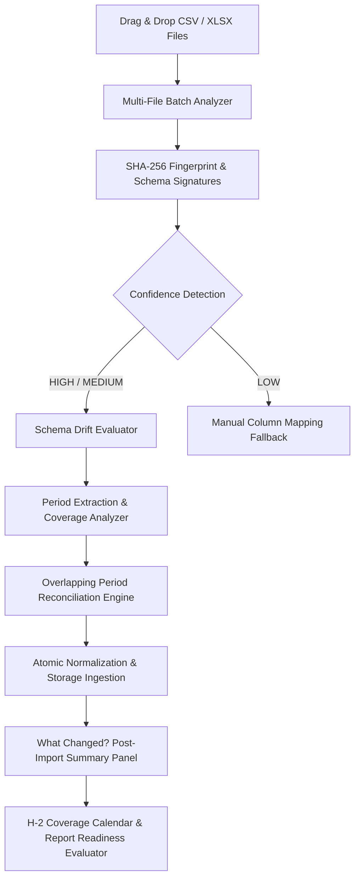

# Phase 2.1 — File-Based Data Automation & Reporting Workflow

## Executive Summary

Phase 2.1 delivers a seamless, robust, and automated file-based ingestion pipeline for AffiliateOS, optimizing manual marketplace export workflows. Since AffiliateOS intentionally operates without live Shopee or TikTok Shop API access, file uploads serve as the primary ingestion interface. Phase 2.1 eliminates manual friction by turning export uploads into an automated, error-resilient, and transparent data pipeline.

### Permanent Product Constraint
* **No Live Marketplace APIs**: AffiliateOS does **NOT** use live Shopee API or TikTok Shop API.
* **No Out-of-Scope Automation**: OAuth onboarding, API credential forms, polling, web scraping, cookie capturing, and browser automation are permanently out of scope.
* **Human Business Confirmations**: `DEFERRED BY USER`. All 8 open questions from Phase 1.7B remain deferred. No production metric formulas were altered.

---

## Technical Architecture

### Core Components (`lib/imports/automation.ts`)

1. **SHA-256 File Fingerprinting (`computeFileFingerprint`)**:
   Calculates cryptographic hashes of uploaded files before upload processing to prevent duplicate file processing and enforce upload idempotency.

2. **Versioned Schema Signatures (`schemaSignatures`)**:
   Defines canonical header structures for supported export formats:
   - `shopee-payment-order-v1`
   - `tiktok-payment-order-v1`
   - `stock-export-v1`

3. **Content-Based Schema Detection & Confidence (`detectFileSchema`)**:
   Automatically detects marketplace (`Shopee` | `TikTok`) and report type (`SHOPEE_PAYMENT_ORDER`, `TIKTOK_PAYMENT_ORDER`, `STOCK_EXPORT`). Assigns confidence ratings:
   - **`HIGH`**: All required signature headers matched cleanly.
   - **`MEDIUM`**: Most required headers matched.
   - **`LOW`**: Minimal header match; triggers manual column mapping fallback.

4. **Schema Drift Detection (`SchemaDriftReport`)**:
   Evaluates uploaded file headers against versioned signatures. Detects newly added marketplace columns or missing expected columns without failing the import. Displays user warning banners: *"Marketplace export format appears to have changed."*

5. **Period Coverage Extraction (`extractFilePeriod`)**:
   Parses date columns within raw CSV/XLSX files to extract start and end dates (`periodStart` to `periodEnd`) covering the file dataset.

6. **Overlapping Period Reconciliation (`reconcileOverlappingRows`)**:
   Reconciles overlapping date ranges (e.g. uploading a 1–6 Sep export followed by a 1–13 Sep export) using canonical composite keys (`date | account_id | campaign_id`). Categorizes rows into:
   - `New`: Newly introduced performance records.
   - `Existing Unchanged`: Records matching identical GMV values.
   - `Updated`: Records where revised GMV values update prior estimates.
   - `Conflict`: Ambiguous or conflicting records flagged for review.

7. **"What Changed?" Summary Engine (`computeWhatChangedSummary`)**:
   Generates a post-import breakdown showing:
   - **`+GMV Delta`**: Total new affiliate GMV introduced by the import.
   - **`+New Active Creators`**: Count of creators generating sales for the first time in the coverage period.
   - **`Coverage Extension`**: Updated coverage end date.

8. **Data Coverage Calendar & H-2 Readiness Evaluator (`getWorkspaceDataCoverage`)**:
   Evaluates data coverage completeness up to H-2 (two days prior to today). If H-2 data is incomplete, generates an operational action (`DATA_COVERAGE_SHOPEE_MISSING` / `DATA_COVERAGE_TIKTOK_MISSING`) and displays a yellow warning box blocking report preparation.

---

## User Experience Workflows

### 1. Smart File Drop & Multi-File Batch (Import Center)
- Drag and drop single or multiple CSV/XLSX export files simultaneously.
- Batch analyzer automatically parses all files, showing detection status badges (`Shopee`, `TikTok`, `HIGH confidence`, `Schema Drift Warning`).
- Overlap reconciliation preview details how duplicate dates will be safely merged.
- Single-click **"Import All Files"** batch execution.

### 2. Streamlined 9-Step Report Preparation Workflow (Reports Workspace)
- **H-2 Coverage Summary Widget**: Visual coverage bars for Shopee and TikTok. Displays green readiness badges when H-2 data is present, or yellow warnings when data is missing.
- **Streamlined Preparation Bar**: Steps 1 to 9 guided progress bar.
- **PPT Slide Preview Cards**: Interactive preview cards for deck slides. Slide 19 cleanly renders `SOURCE_UNAVAILABLE (Rank-Up Program data not imported)` when rank-up data is omitted.

### 3. Simplified Data Sources Settings (`Settings → Integrations`)
- Displays Shopee and TikTok connectors as `FILE_IMPORT` data sources.
- Displays clear explanatory notice: *"Direct API integration is not used for this workspace. Import marketplace export files instead."*

---

## Verification & Test Strategy

Comprehensive test coverage implemented in `tests/file-automation.test.ts`:
- File fingerprinting determinism.
- Schema auto-detection & confidence rating.
- Schema drift warning generation on header changes.
- Multi-file batch classification.
- Date period extraction.
- Overlapping period reconciliation without double counting.
- Post-import "What Changed?" summary calculation.
- Data coverage model & H-2 readiness evaluation.
- Report preparation workflow readiness state.
