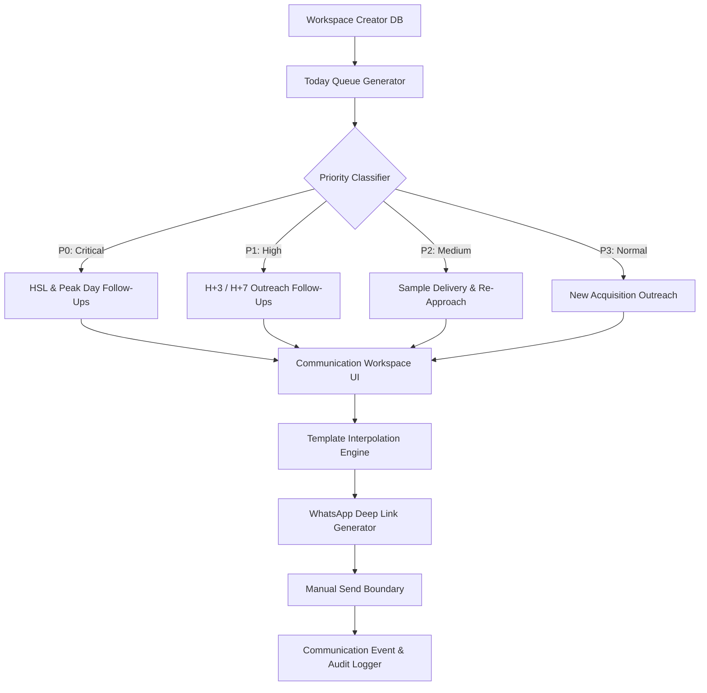

# Phase 2.2 — Creator Communication & Outreach Workspace

## Executive Summary

Phase 2.2 delivers the **Creator Communication & Outreach Workspace**, empowering the operations team ("Dinda's daily workflow") to execute prioritized creator outreach, follow-ups, re-approaches, sample tracking, and Peak Day confirmations with zero friction and maximum safety.

### Permanent Constraints & Product Rules
* **No Live Marketplace APIs**: Shopee API and TikTok Shop API are permanently out of scope.
* **Strict Manual Send Boundary**: AffiliateOS prepares message payloads and generates formatted WhatsApp deep links (`wa.me`). **Opening WhatsApp or copying message text does NOT automatically send messages or mark creators as contacted.** The user must review, send manually, and explicitly log interaction results (`Mark as Contacted` or `Log Response`).
* **Deterministic Template Engine (No AI / LLMs)**: Message interpolation relies strictly on structured variable replacement with fallback defaults (`{creator_name}`, `{channel_name}`, `{top_product_name}`, `{brand_name}`, `{sales_30d_formatted}`, etc.).
* **Single Source of CRM Truth**: Uses existing workspace database entities (`creators`, `creator_outreach`, `hsl_activations`, `sample_seedings`, `campaign_creators`). No redundant CRM structures were created.
* **Privacy & Security**: Sensitive phone numbers and email addresses are protected by Row-Level Security (RLS) policies and excluded from audit logs and public exports.
* **Human Business Confirmations**: `DEFERRED BY USER`. All open business confirmation questions remain deferred. Production reporting formulas were not altered.

---

## Technical Architecture

### Core Schema (`supabase/migrations/202609230003_communication_workspace.sql`)

1. **`communication_templates`**:
   - `id`, `workspace_id`, `slug`, `title`, `channel`, `category`, `description`, `is_active`, `created_at`, `updated_at`.
2. **`communication_template_versions`**:
   - `id`, `template_id`, `version`, `body_template`, `placeholders`, `change_reason`, `created_by`, `created_at`.
3. **`communication_events`**:
   - `id`, `workspace_id`, `creator_id`, `template_id`, `template_version`, `channel`, `direction`, `status`, `variables_snapshot`, `final_text`, `sent_at`, `logged_by`, `notes`, `created_at`.
4. **`communication_preparations`**:
   - `id`, `workspace_id`, `batch_id`, `creator_id`, `template_id`, `status`, `interpolated_text`, `whatsapp_link`, `created_at`.

### Core Modules (`lib/communication/`)

1. **`templates.ts` (Template Engine & Versioning)**:
   - `extractPlaceholders(text)`: Scans strings for `{variable_name}` patterns.
   - `validateTemplateSyntax(text)`: Validates placeholder syntax against supported system variable keys.
   - `interpolateTemplate(text, data)`: Replaces placeholders with creator attributes or fallback strings (`[product name]`).
   - `incrementTemplateVersion(template, newBody, reason)`: Implements immutable version increments on template edits.

2. **`queue.ts` (Prioritized Daily Queue & Safety Guards)**:
   - `normalizePhoneNumber(raw)`: Standardizes Indonesian phone numbers (`+62`, `08...` -> `628...`).
   - `generateWhatsAppLink(phone, text)`: Encodes message text safely for `https://wa.me/<phone>?text=<encoded>`.
   - `generateTodayQueue(creators, outreach, hsl, samples)`: Prioritizes daily operational tasks into P0-P3 tiers.
   - `isBlacklisted(creator)`: Flags blacklisted creators and displays warning badges.
   - `hasRecentContact(creator, days=3)`: Detects duplicate contact attempts within a 3-day window.

3. **`bulk.ts` (Bulk Preparation Engine)**:
   - `prepareBulkCommunication(creators, template, options)`: Prepares batch outreach packages with individual WhatsApp links, checking phone availability and duplicate contact guards.

---

## User Experience Workflows

### 1. Communication Workspace (`/communication`)
- **Daily Progress Counter**: Displays completed interactions vs. daily goal (e.g., 12/25 contacted today).
- **Queue Tabs**:
  - `Today Queue`: Prioritized list of creators requiring immediate action.
  - `Follow-Up`: Active creators awaiting H+3, H+7, or H+14 check-ins.
  - `New Outreach`: Newly qualified acquisition creators.
  - `Re-Approach`: Inactive or previously non-responsive creators eligible for re-engagement.
  - `Waiting Response`: Outreach logged but awaiting creator reply.
  - `Interested`: Creators who accepted commission terms.
  - `History`: Audit trail of all logged communication events.
- **Bulk Action Drawer**: Multi-select creators to prepare batch messages, review interpolated previews, and copy or open WhatsApp links sequentially.

### 2. Contact & Log Drawer
- Visualizes template previews with highlighted variables.
- One-click copy for message text.
- Direct **"Open WhatsApp"** button opening `https://wa.me/...`.
- Explicit **"Mark as Contacted"** and **"Log Response"** buttons with status transition options (`Contacted`, `Interested`, `Sample Requested`, `Declined`, `Blacklisted`).

### 3. Communication Settings (`/settings/integrations → Communication Templates`)
- Manage operational draft templates (`[DRAFT] First Outreach — Shopee`, `[DRAFT] H+3 Follow-Up`, etc.).
- Real-time syntax validation for `{placeholders}`.
- Full version history audit trail (`Version 1`, `Version 2`, change notes, timestamp, author).

### 4. Creator Operational Timeline (`/creators/[id]`)
- Integrated `CreatorOperationalTimeline` component rendering stage progress:
  `Imported → Acquisition → Contacted → Follow-Up → Responded → Sample → HSL → Campaign → Deal`.
- Quick action drawer link for instant WhatsApp outreach.

---

## Verification & Test Strategy

All features are verified by unit and integration tests in `tests/communication-workspace.test.ts`:
- **Template Placeholder Validation & Interpolation**: Verifies variable parsing, substitution, and missing value fallback.
- **Template Versioning & Audit Trail**: Verifies version incrementing and snapshot immutability.
- **Phone Number Normalization & WhatsApp Encoding**: Verifies `+62`, `08`, spacing cleanup, and URI component encoding.
- **Today Queue Generator & Rule Prioritization**: Verifies P0 (HSL/Peak Day), P1 (H+3/H+7), P2 (Samples/Re-Approach), P3 (New Outreach) priority sorting.
- **Duplicate Contact Guard & Blacklist Safety**: Verifies <3-day duplicate warnings and blacklist exclusion.
- **Bulk Message Preparation Engine**: Verifies batch generation of interpolated messages and safety warnings.

Automated Test Results:
- `npm test`: **60/60 tests PASS**
- `npx tsc --noEmit`: **0 errors**
- `npm run build`: **PASS (Clean SSR & client bundles)**
