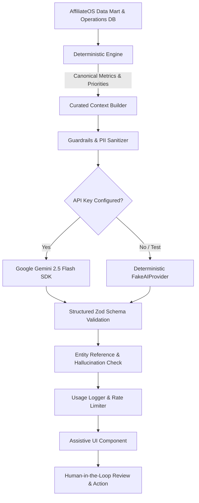

# Phase 2.3 — Gemini AI Copilot for Affiliate Operations

## Executive Summary

Phase 2.3 introduces the **Gemini AI Copilot** as an **assistive intelligence layer** atop AffiliateOS. It augments the operations team ("Dinda's daily workflow") with AI-generated first drafts, synthesized performance observations, automated daily morning briefs, report narrative summaries, and interactive natural-language querying.

### Assistive Copilot Principles & Boundaries
1. **Assistive, Never Autonomous**: Gemini produces drafts, summaries, and recommendations. It **NEVER** mutates underlying data, auto-sends messages, auto-approves samples, or alters creator statuses.
2. **Strict Manual Send Boundary**: Outreach drafts populate editable message fields with an "AI Draft" badge. Execution remains strictly manual via the existing WhatsApp (`wa.me`) integration.
3. **Deterministic Systems Remain Sole Source of Truth**: All metrics (GMV, orders, units, commissions), operational priorities (P0/P1/P2/P3), stock warnings, sample statuses, and H-2 readiness checks are calculated deterministically by existing rule engines before curated summaries are passed to Gemini.
4. **Server-Side Security**: `GEMINI_API_KEY` is strictly server-side (`process.env.GEMINI_API_KEY`). It is **never** exposed to the browser via `NEXT_PUBLIC_` or API responses.
5. **Offline & Test Decoupling**: AffiliateOS provides a deterministic test provider (`FakeAIProvider`) so all unit and integration tests run offline without external API dependencies or costs.
6. **No Marketplace APIs**: Shopee and TikTok APIs remain permanently out of scope. File-based imports remain the primary ingestion method.
7. **Business Questions Remain Deferred**: All 8 business confirmation questions (BQ-01 through BQ-08) remain `DEFERRED BY USER`.

---

## Technical Architecture



### Core Pipeline Modules (`lib/ai/`)

| Module | Purpose |
|---|---|
| `types.ts` | Complete TypeScript contracts, enums (`AIFeature`, `OutreachTone`, `AIRequestStatus`), interfaces, and `AIProvider` contract. |
| `schemas.ts` | Strict Zod validation schemas for all 5 domains ensuring runtime response format guarantees. |
| `prompts.ts` | Versioned system prompts with anti-hallucination guardrails, Bahasa Indonesia/English support, and output constraints. |
| `guardrails.ts` | PII sanitization (phone numbers, emails, tokens), prompt injection defense, XML-style boundary delimiters, and entity reference validation. |
| `context.ts` | Domain context builders aggregating canonical metrics, HSL status, sample tracking, and Action Center items without raw workbook dumps. |
| `usage.ts` | In-memory rate limiter (30 req/min, 2-second per-feature cooldown) and usage tracking metrics. |
| `gemini-provider.ts` | Production provider using official `@google/genai` SDK with `gemini-2.5-flash` model and structured JSON outputs. |
| `fake-provider.ts` | Deterministic offline test provider ensuring 100% test coverage without live network calls. |
| `client.ts` | Factory resolving production vs test provider, system status reporter, and admin connectivity verification. |

---

## The 5 Assistive AI Features

### 1. Creator Outreach Assistant (`OUTREACH_DRAFT`)
- **Location**: Communication Workspace (`/communication`).
- **Trigger**: Click **"Draft with Gemini"** next to standard templates.
- **Controls**: Tone selector (**Casual**, **Formal**, **Urgent**, **Celebratory**), language selector.
- **Output**: Context-aware outreach message populated with creator details, brand benefits, and call to action.
- **Safety**: Populates the editable message draft area. Does **not** send WhatsApp messages automatically or alter contact history.

### 2. Creator Performance Insights (`CREATOR_INSIGHT`)
- **Location**: Creator Workspace & Creator Detail Drawer (`/creators`).
- **Trigger**: Embedded `CreatorPerformanceInsightCard` with auto-generation and refresh button.
- **Output**:
  - Executive 2-3 sentence performance summary.
  - Positive performance signals (e.g. conversion velocity, sales consistency).
  - Risk signals (e.g. inactivity, low engagement).
  - Suggested next steps (e.g. Peak Day campaign invite, sample seeding).
  - Explicit data limitations disclaimer.
- **Safety**: Preserves exact deterministic GMV and order counts; user feedback buttons (Helpful / Not Helpful).

### 3. Operational Daily Brief (`DAILY_BRIEF`)
- **Location**: Executive Dashboard (`/dashboard`).
- **Trigger**: `AIDailyBriefCard` displayed prominently at the top of the dashboard.
- **Output**:
  - Morning headline summarizing operational posture.
  - Top 3 prioritized Action Center items with clickable deep links (`/actions`).
  - Watchlist items (stock alerts, pending samples, overdue outreach).
  - Data freshness indicator (e.g. H-2 data coverage status).
- **Safety**: Derived exclusively from prioritized P0/P1 operational actions.

### 4. Report Narrative Assistant (`REPORT_NARRATIVE`)
- **Location**: Reporting Workspace (`/reports`).
- **Trigger**: **"Draft with Gemini"** in Report Detail and Narrative Drawer.
- **Output**:
  - Key highlights and top accomplishments.
  - What went well (brand growth, top creator performance).
  - Issues & operational headwinds (stockouts, deactivated creators).
  - Strategic next actions for the upcoming week.
- **Safety**: Operates strictly on structured `reportDataset` JSON; click **"Use Draft"** populates editable form inputs without automatically saving or freezing the report.

### 5. Ask AffiliateOS (`ASK_AFFILIATEOS`)
- **Location**: Global Top Navigation Bar (`AskAffiliateOSButton`).
- **Trigger**: Slide-over assistant drawer accessible from anywhere in the application.
- **Features**:
  - Quick question prompt chips ("Creators needing follow-up today?", "Top P0 actions?", "Stock risks?").
  - Natural language querying in Indonesian or English.
  - Referenced entity pills linking directly to related creators, actions, or campaigns.
  - Strict scope limitation: responds "Information not available in current dataset" when querying outside known operational context.

---

## Database Migration (`supabase/migrations/202609240001_gemini_copilot.sql`)

Two dedicated audit and feedback tables isolated with Row-Level Security:

```sql
-- AI Request Execution Log
CREATE TABLE ai_request_logs (
    id UUID PRIMARY KEY DEFAULT gen_random_uuid(),
    workspace_id UUID NOT NULL REFERENCES workspaces(id) ON DELETE CASCADE,
    user_id UUID REFERENCES auth.users(id),
    feature TEXT NOT NULL,
    prompt_version TEXT NOT NULL,
    model TEXT NOT NULL,
    status TEXT NOT NULL CHECK (status IN ('SUCCESS', 'FAILED', 'RATE_LIMITED')),
    input_tokens INTEGER,
    output_tokens INTEGER,
    latency_ms INTEGER,
    error_message TEXT,
    created_at TIMESTAMPTZ NOT NULL DEFAULT timezone('utc', now())
);

-- AI User Feedback
CREATE TABLE ai_feedback (
    id UUID PRIMARY KEY DEFAULT gen_random_uuid(),
    workspace_id UUID NOT NULL REFERENCES workspaces(id) ON DELETE CASCADE,
    user_id UUID REFERENCES auth.users(id),
    log_id UUID REFERENCES ai_request_logs(id) ON DELETE SET NULL,
    feature TEXT NOT NULL,
    rating TEXT NOT NULL CHECK (rating IN ('HELPFUL', 'NOT_HELPFUL')),
    comment TEXT,
    created_at TIMESTAMPTZ NOT NULL DEFAULT timezone('utc', now())
);
```

---

## Verification & Quality Assurance

### Automated Test Suite (`npm test`)
- **Total Tests**: **70/70 PASSING** (0 failures, 0 skipped).
- **Existing Regression**: 60/60 tests pass completely unaltered.
- **New Phase 2.3 Tests** (`tests/gemini-copilot.test.ts`):
  1. Provider Abstraction & FakeAIProvider Determinism
  2. Zod Schema Validation & Malformed Payload Rejection
  3. Guardrails: PII Sanitization, Delimiters & Entity References
  4. Rate Limiter & Usage Tracker Enforcement
  5. Feature 1: Creator Outreach Assistant Context & Manual Send Boundary
  6. Feature 2: Creator Performance Insights Context & Data Preservation
  7. Feature 3: Operational Daily Brief Context & Priority Ranking
  8. Feature 4: Report Narrative Assistant Structured Takeaways
  9. Feature 5: Ask AffiliateOS Safe Query Routing & Entity Awareness
  10. Security: Server-Side API Key & Privacy Guarantee

### Static Analysis & Build Verification
- **Linter (`oxlint`)**: 0 warnings, 0 errors across 188 files.
- **TypeScript (`tsc --noEmit`)**: 0 type errors.
- **Production Build (`npm run build`)**: Successfully compiled all routes, including 7 new `/api/ai/*` endpoints.
